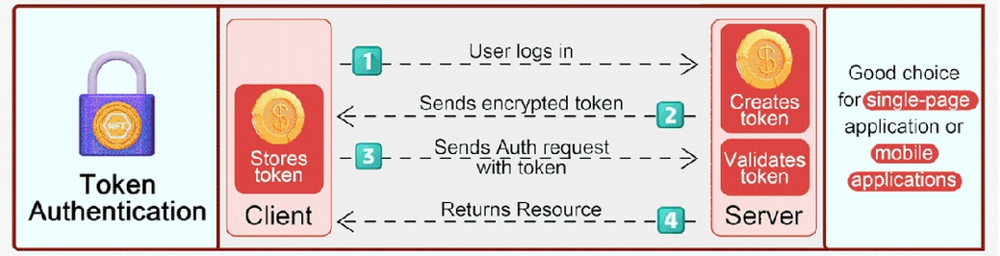

# 👥 User Authentication - Advanced Demo App ✅👌: How it works



## Caveat

Please, make sure you are comfortable with the [`simple-demo-app`](../simple-demo-app/) before studying this app, as this one is more involved, and there are more moving parts.

## Recap

As we have seen in the other app, after creating a user via a `POST` request sent manually to the server, the user can log in using the credentials.

When the user logs in, the backend validates the credentials, and sends back to the frontend a crypto-signed token. The frontend stores this token in the browser's local storage, so it 'remembers' the session. If the token expires (after one hour), is not valid, or the user logs out, then he/she will have to log in again.

## How this app differs

The main novelty in this application is the inclusion of the basic CR(U)D operations (Create, Read, Update, and Delete - we have omitted the Update operation to simplify this demo). However, there is a catch: **only authenticated users will be able to perform these operations**. 

Besides this, this app is build on top of `simple-demo-app`, and it has to be understood as its natural evolution.

## Overview

This app is called 'Quotelist'. Users can log in, *add* quotes by famous (or not-so-famous) people, *view* them, and *delete* them. Notice that only the users that created a quote have the ability to delete them, and that only logged-in users can add quotes to the database. Learn how this is achieved is the main reason of this demo.

## Setup 

Please, go to `advanced-demo-app/backend`, and run the command:

```sh
npm run dev
```

Then, go to `advanced-demo-app/frontend` folder, and, again, run this command:

```sh
npm run dev
```

## Creating another user

Let's create another `test` user. This time, send another `POST` request with Postman, Insomnia or similar, to the backend server's user creation endpoint: `http://localhost:3020/api/users`, with the following JSON payload:

```json
{
	"username": "test2",
	"name": "test2",
	"password": "1234"
}
```

Don't forget the `Content-Type: application/json` header.

Now there are two users in the database (you created the first one for the `simple-demo-app`, and both apps share the same database for demo purposes).

## Adding a quote

Go to whatever location the frontend is running, by default <http://localhost:5173/>.
Log in with the recently created testing user: username: `test`, password: `1234`.

You should not see any quote yet, let's add one. Just enter a title for the quote, an author, and click on `Add new quote`.

### How this works

Keeping on mind that the frontend app stores [the object received from the backend when the user logs in](../simple-demo-app/HOW_IT_WORKS.md#users-login), containing: 

- the token
- some other user data.

The frontend assigns [the variable `user` to this object](./frontend/src/App.jsx) (line 27), and, most importantly, in this app, on line 28 of the same file:

>**It sets the token _privately_ to the module `quotes.js`** (privately means that no other module - JavaScript file - can access it from the outside), **with the format `'Bearer <token content>'`, via the [`setToken` function](./frontend/src/services/quotes.js).**

From now on, that token (now a string with the format `'Bearer <token content>`) will be attached to every CRUD request sent to the backend via a header `Authorization`. This header is attached via a `config` object in the Axios requests, within the [quotes service](./frontend/src/services/quotes.js). You can see this in the `createQuote` and `deleteQuote` functions.

This way, the backend can know that the client that sends these requests are allowed to perform these CRUD operations, because **only authenticated users can be owners of a cryptographically signed token.**

## The backend perspective

In this `advanced-demo-app`, [**the backend server now uses two middleware functions**](./backend/utils/middleware.js) (functions that will process each request that arrives to the server, before a response is sent back - like *intermediary* functions, functions that are in the middle, between the request arrival and the sending of the response):

- `tokenExtractor`
- `userExtractor`

These two middleware functions will act for each request sent from the frontend. Remember we are attaching the token via the `Authorization` header.

- `tokenExtractor` **will check the validity of the received token's format**. If it is valid, it will attach to the request object a property `token`, containing the token, so every subsequent function that deals with the request (routes, other middleware, etc.), can simply query that property to access the token.

- `userExtractor` **verifies the crypto-sign in that token** (note that it accesses the token via the `token` property we added to the request object in the `tokenExtractor`). **If the token is not valid, the request won't progress further** in the server: a response will be sent back to the frontend with an HTTP code 401: a bad request, invalid token. If the token is valid, a `user` property will be attached to the request property, containing the MongoDB user data, so every subsequent function that deals with the request (routes, other middleware, etc.), can simply query that property to access the user data.
